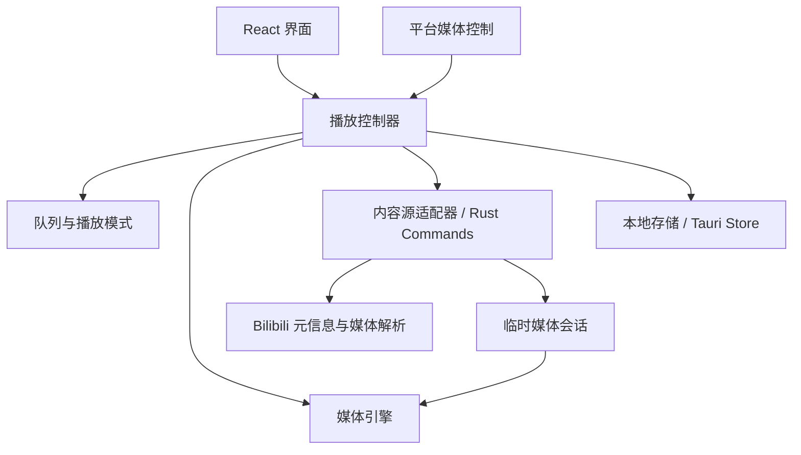

# bMuisc 项目规划

本文将 [项目说明](../README.md) 中的方向细化为开发顺序、模块边界和验收标准，作为后续实现的依据。

当前状态：**方案阶段，所有开发任务均未开始**。下文的架构和指标为初始建议；媒体引擎、平台支持和性能目标需要通过实际验证确认。

## 1. 产品目标与取舍

做一个以 B 站音乐内容为来源、以听歌为主要交互的本地播放器。用户可以把现场、翻唱、演唱会和合集加入队列，在需要时打开视频观看。

第一版优先解决三个问题：

1. 添加内容方便：粘贴链接或 BV 号即可选择分 P 并加入队列。
2. 连续播放可靠：切歌、暂停、拖动进度和循环模式行为一致。
3. 音视频切换自然：保留同一条内容的播放进度，不重复出声，失败后仍能操作。

首版以 Windows 桌面端为验证目标，随后适配 macOS 和 Linux。Android / iOS 单独安排可行性验证，不把桌面端实现直接视为移动端完成。

产品初期不依赖自建服务。搜索、账号、收藏夹导入、歌词、推荐和云同步不占用首版开发优先级；不规划媒体下载和转存功能。

## 2. 核心使用流程

### 2.1 添加与播放

1. 用户在主界面输入标准 B 站视频链接或 BV 号。
2. 应用校验输入，展示元信息；多分 P 内容展示可选择的列表。
3. 用户选择“加入队列”或“立即播放”；加入队列不打断当前播放。
4. 立即播放将选中的内容加入队列并切换到该条目，默认进入音频模式。
5. 结束后按当前播放模式推进，用户可以随时调整队列。

第一版先支持标准链接和 BV 号。短链接支持放到后续兼容任务；若实现重定向解析，需逐次校验目的地址和最大跳转次数。

### 2.2 打开与收起视频

打开视频不会切换曲目。界面先显示加载状态，资源就绪后对齐当前播放时间；期间用户仍能暂停或切歌。收起画面后继续听音频，并停止不必要的视频加载与解码。

如果视频无法加载，保留可用的音频播放并提示重试。用户在暂停状态下打开视频，准备完成后仍保持暂停。

### 2.3 退出与恢复

保存队列、当前条目、进度、音量和循环模式。重新打开应用后恢复界面，由用户点击播放；临时媒体地址重新获取。

首版窗口最小化时可以继续播放，关闭主窗口则退出并保存状态。托盘及“关闭窗口后继续播放”作为后续独立能力，避免关闭行为不明确。

## 3. 功能优先级

| 优先级 | 功能 | 完成边界 |
| --- | --- | --- |
| P0 | 媒体可行性验证 | 明确可用访问方式、媒体格式、音频播放及视频切换路径 |
| P0 | 链接添加与分 P | 正确识别输入并选择单个或全部分 P |
| P0 | 播放控制与队列 | 播放、暂停、定位、音量、切歌、排序及四种播放模式 |
| P0 | 音视频模式切换 | 保持曲目和播放状态，无双重声音，失败可恢复 |
| P0 | 本地恢复与错误处理 | 重启恢复记录，网络与内容错误有可操作反馈 |
| P1 | 本地歌单 | 创建、重命名、删除歌单，添加和移除曲目 |
| P1 | 系统集成 | 媒体快捷键、系统媒体控制、可配置的托盘行为 |
| P1 | 其他桌面平台 | 在 macOS / Linux 真机分别构建和验证 |
| P2 | 搜索、登录、收藏夹导入 | 先确认接口和授权方式，再定义具体范围 |
| P2 | 移动端 | 验证后台播放、音频焦点、锁屏控制及平台发布条件 |

P0 全部完成并通过验收后，才开始扩展体验功能。

## 4. 界面与交互规划

首版使用一个主窗口，保持添加入口和播放控制容易找到。

| 区域 | 内容与行为 |
| --- | --- |
| 顶部 | 链接输入、解析状态、添加入口 |
| 主内容区 | 当前内容封面、标题、UP 主、原页面入口；展开后展示视频 |
| 队列区域 | 曲目与分 P 名称、当前项标记、播放、移除和排序 |
| 底部播放栏 | 上一首、播放 / 暂停、下一首、进度、音量、播放模式、视频开关 |
| 状态反馈 | 空队列指引、解析失败、缓冲、内容失效、需要登录和重试入口 |

缩小窗口时，优先保留播放控制，队列可以收起。界面以标题和状态文字配合图标，不仅用颜色表达错误或当前状态。所有基础操作应可通过键盘访问。

先实现一套清晰、统一的视觉样式；主题切换、动效和迷你播放器在核心播放稳定后安排。

## 5. 架构与职责

采用 Tauri 2 + React + TypeScript + Vite，Zustand 管理前端业务状态，Rust 承担内容源访问和原生能力，Tauri Store 保存首版数据。



### 模块约定

- **界面层**只发出用户意图并展示状态，不直接调用平台解析接口或操纵多个媒体元素。
- **播放控制器**是播放行为的唯一入口，统一处理切歌、定位、模式切换、重试和资源释放。
- **队列模块**只处理条目和顺序，不依赖 B 站接口；便于单独验证循环和随机行为。
- **内容源适配器**把平台响应转为内部数据结构，隔离接口字段和访问方式变化。
- **媒体引擎**提供加载、播放、暂停、定位、模式切换、销毁和事件通知；具体实现由技术验证决定。
- **平台适配层**把系统媒体按钮转为控制器操作，不建立第二套播放逻辑。
- **存储模块**处理数据版本、读写和恢复，不保存临时媒体会话。

播放进度以媒体引擎实际报告为准。Zustand 保存界面需要的状态，不逐帧更新整个应用；媒体对象不参与持久化。

### 建议的数据模型

| 对象 | 主要字段 | 是否持久化 |
| --- | --- | --- |
| 曲目引用 | 来源、视频标识、分 P 标识 | 是 |
| 元信息快照 | 标题、分 P 标题、作者、封面、时长、原页面地址 | 是，允许刷新 |
| 队列条目 | 独立条目 ID、曲目引用、元信息快照 | 是 |
| 播放快照 | 当前条目 ID、进度、音量、静音、播放模式 | 是 |
| 媒体会话 | 临时音视频地址、格式、已知有效期、当前操作编号 | 否 |
| 存储文件 | 数据版本号、队列、设置、最近播放 | 是 |

条目 ID 与视频标识分离，使同一内容重复添加后仍可独立排序和删除。存储放在操作系统的应用数据目录，采用节流写入，并在暂停、切歌和退出时补充保存；不依赖退出事件作为唯一保存时机。

读取时校验数据版本和字段。无法恢复的记录应提示用户并允许重建，避免损坏记录阻止应用启动。

## 6. 播放状态和边界行为

生命周期使用 `idle / resolving / loading / ready / buffering / ended / error`；另行记录用户期望的播放或暂停状态，以及期望的音频或视频模式。缓冲结束和异步请求完成后，都要遵循最新用户意图。

每次切歌创建新的操作编号并取消旧任务。异步回调必须检查编号，旧曲目的解析、加载或刷新结果不能覆盖新曲目。卸载媒体引擎时同时释放请求、事件订阅和媒体资源。

### 队列规则

- 顺序播放到最后一项后停止；列表循环回到第一项。
- 单曲循环仅影响自然播放结束；用户主动上一首 / 下一首仍切换曲目。
- 随机播放在一轮内尽量不重复，上一首根据实际播放历史返回；队列变化时同步更新候选集合。
- 删除当前播放项时选择其后继；没有后继则选择剩余第一项。此前正在播放则继续播放新项，此前暂停则保持暂停。
- 清空队列后停止播放并释放媒体资源；排序不改变当前播放项。
- 内容失败时显示重试和跳过入口，首版不默认连续自动跳过整张队列。

### 音视频同步策略

优先验证能够统一管理音视频轨的播放方案。若采用音频主时钟加独立视频画面，必须验证缓冲、定位和长时间播放下的偏移校正，不能只在展开时同步一次。

切换时只允许一个有声通道。视频切换失败尽量保留原音频；如果引擎必须重建媒体源，则保存最新进度和用户意图，并明确展示短暂缓冲。

### 异常处理

| 场景 | 预期处理 |
| --- | --- |
| 输入无效 | 在解析前提示支持的格式 |
| 需要登录或没有访问权限 | 说明当前限制，提供原页面入口，不循环重试 |
| 视频删除或分 P 失效 | 保留队列记录并标记不可用，允许移除或跳过 |
| 网络超时 | 保留进度，有限重试后交给用户选择 |
| 临时媒体地址失效 | 重新解析并恢复最新进度，同一故障恢复过程最多自动刷新一次 |
| 媒体格式不支持 | 如有兼容资源则选择兼容资源，否则提示当前平台限制 |
| 视频加载失败、音频可用 | 继续音频播放，允许重新打开视频 |

日志只记录诊断所需的状态、错误类别和耗时，不记录凭据及带签名的完整媒体地址。

## 7. 开发阶段与交付物

各阶段按依赖推进，不在技术验证前承诺交付日期。

### M0：媒体可行性验证

目标：确认产品的核心路径实际成立。

- [ ] 在 Windows 验证允许访问的普通视频与多分 P 内容。
- [ ] 验证元信息读取、独立音频、视频轨、定位和临时地址刷新。
- [ ] 记录目标 WebView 对实际媒体编码和容器的支持情况。
- [ ] 对比直接播放与必要的 MSE 方案，确定媒体引擎。
- [ ] 验证音频模式的网络请求，确认是否停止传输视频。
- [ ] 验证至少一次连续播放、切换视频、收起视频、切歌和失败恢复。

交付物：可复现的验证步骤与结果、媒体引擎选择理由、已知限制。后续进入开发时再创建验证代码，不在本次规划中初始化工程。

通过条件：找到符合使用条件、可以重复验证的播放路径；核心条件不成立时，应先调整方案，不进入完整界面开发。

### M1：应用基础与内容添加

- [ ] 初始化 Tauri、前端、基础构建和代码检查配置。
- [ ] 实现内容源适配器及内部数据结构。
- [ ] 完成主窗口、链接输入、解析反馈和分 P 选择。
- [ ] 完成队列添加、移除与排序。

交付物：可以运行的应用骨架，真实元信息可进入队列；开发用模拟数据与真实解析流程明确分开。

### M2：核心播放器

- [ ] 接入媒体引擎与统一播放控制器。
- [ ] 完成播放控制、四种播放模式和视频区域。
- [ ] 完成音视频切换、请求取消和旧结果隔离。
- [ ] 验证长视频定位、持续播放和队列推进。

交付物：从添加内容到听音频、看视频的完整操作路径。

### M3：稳定性与首版交付

- [ ] 实现设置、队列、最近播放和进度恢复。
- [ ] 完成地址失效、断网、内容不可用等错误处理。
- [ ] 验证资源释放、重复切换和长时间播放。
- [ ] 生成 Windows 安装包，并验证安装、启动、播放和卸载。
- [ ] 记录已知问题和首版使用说明。

交付物：通过下述验收矩阵的 Windows 首版。开发构建运行成功不等于安装包交付完成。

### M4：体验与平台扩展

先做本地歌单和系统媒体控制，再按实际环境验证 macOS / Linux。移动端需要单独验证后台生命周期、系统音频会话与 WebView 限制，必要时引入原生播放实现，复用既有业务接口。

## 8. 验证与首版验收

队列和状态转换使用针对行为的单元测试；内容源使用脱敏样例验证响应转换，另做少量真实内容验证。真实网络验证不作为普通单元测试的前提，以免远端波动导致构建不稳定。

| 范围 | 核心验收场景 |
| --- | --- |
| 内容添加 | 有效链接、BV 号、无效输入、单 P、多 P、重复添加 |
| 基础播放 | 播放 / 暂停、连续切歌、首尾定位、音量与静音 |
| 播放模式 | 空队列、单项、多项、自然结束、主动切歌、随机历史 |
| 队列修改 | 删除当前项、删除末项、排序、清空、播放中添加 |
| 视频切换 | 播放时切换、暂停时切换、连续开关、加载中切歌、全屏退出 |
| 异步竞争 | 旧解析晚返回、刷新中切歌、缓冲中暂停、定位后立即切换模式 |
| 故障恢复 | 断网、超时、地址失效、视频失效、格式不支持、存储损坏 |
| 本地恢复 | 正常退出、异常关闭后重启、当前项缺失、配置版本不兼容 |
| 打包运行 | 安装后的实际播放、应用数据目录、原页面跳转、资源释放 |

首版验收要求：

- 不存在阻断核心使用流程的已知问题，暂不支持的情况有明确提示。
- 音视频切换不产生双重声音，不意外跳回开头，也不覆盖用户最新的暂停或切歌操作。
- 暂定切换稳定后的音视频偏移目标为 250 ms 以内；在 M0 确认测量方法和可行性后再固化，当前不视为已达到。
- 完成一次不少于 30 分钟的持续播放与多次切换检查，观察内存、请求及媒体资源是否持续累积。
- 记录固定内容、设备和网络条件下的首声时间、切换耗时与资源占用，形成基线后再确定优化目标。
- 音频模式若无法避免视频传输，必须如实标注限制，不以隐藏画面代替节流验证。

## 9. 待验证决策与维护方式

| 决策 | 决定时机 | 所需依据 |
| --- | --- | --- |
| 媒体引擎与音视频同步方式 | M0 | 实际媒体格式、定位和同步表现 |
| 是否需要本地媒体代理 | M0 | WebView 请求限制与可用的媒体传输方式 |
| 匿名访问可覆盖的内容范围 | M0 | 实际访问条件和平台使用规则 |
| 存储是否需要 SQLite | 本地歌单规模增长后 | 数据量、查询需求和迁移成本 |
| 移动端是否需要原生播放模块 | 移动端验证阶段 | 后台播放、系统控制和格式兼容性 |

若需要本地代理，应限定访问来源和目的地，校验重定向，支持必要的 Range 请求，并验证监听范围、会话隔离和关闭后的资源释放。Tauri 权限按功能最小化授予。

平台接口变化集中在内容源适配器内处理。依赖升级、内容源变化或新平台适配后，优先重新验证播放和切换矩阵。开发完成一项后再勾选任务，并记录对应验证结果；方案变化同步更新本文和 README，保持已实现能力与计划能力清楚区分。

## 10. 当前维护账号与提交约定

本项目当前使用 GitHub 账号 `roy2651` 推送，提交署名为 `roy2651 <roy2651@gmail.com>`。维护者在新环境中开发时，应在仓库目录内设置本地身份，避免继承其他项目的全局配置：

```shell
git config --local user.name roy2651
git config --local user.email roy2651@gmail.com
git config --local credential.https://github.com.username roy2651
```

远程仓库使用 `https://github.com/roy2651/bMuisc.git`。提交署名和推送认证分别管理：上述配置指定署名及凭据账号，实际推送仍需该 GitHub 账号的有效授权。

每次提交前检查改动范围和必要的验证结果，提交后确认作者、邮箱及远程同步状态。凭据、令牌和本地账号配置不写入版本库；这些身份设置不要求外部贡献者沿用。
