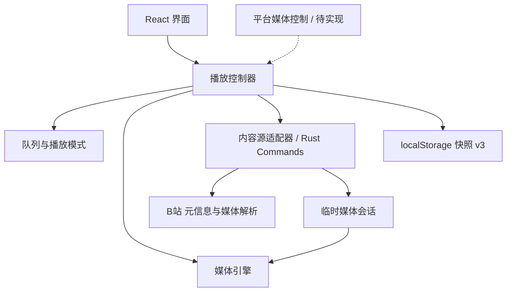

# bMuisc 项目规划

本文将 [项目说明](../README.md) 中的方向细化为开发顺序、模块边界和验收标准，作为后续实现的依据。

当前状态（2026-09-22）：**代码版本 v0.2.3；M0–M2 音频主路径完成，M3 稳定性与交付验收进行中，M4 的本地歌单、最近播放已提前实现**。当前代码基线为 `9b1828a`（封面缩略图优化），本地 `v0.2.0`–`v0.2.3` 标签已存在。发布资产以 GitHub Releases 为准。

音乐库、我的喜欢、自建歌单、最近播放、快照 v3 和多轮播放修复已进入代码；音视频切换、账号登录、设置页（并入自动更新里程碑）、系统媒体控制及 Linux / 移动端能力仍未实现。下文明确区分当前实现、后续目标和待验收事项；历史实机记录不能替代当前版本验收。

## 1. 产品目标与取舍

做一个以 B 站音乐内容为来源、以听歌为主要交互的本地播放器。用户可以把现场、翻唱、演唱会和合集加入队列，在需要时打开视频观看。

第一版优先解决三个问题：

1. 添加内容方便：粘贴链接或 BV 号即可选择分 P 并加入队列。
2. 连续播放可靠：切歌、暂停、拖动进度和循环模式行为一致。
3. 本地管理清楚：音乐库、喜欢、歌单与播放队列独立，保存内容不打断播放。音视频切换自然的目标已移至 M4。

首版以 Windows 桌面端为验证目标，随后适配 macOS 和 Linux。Android / iOS 单独安排可行性验证，不把桌面端实现直接视为移动端完成。

产品初期不依赖自建服务。搜索、账号、收藏夹导入、歌词、推荐和云同步不占用首版开发优先级；不规划媒体下载和转存功能。

## 2. 核心使用流程

### 2.1 添加与播放

1. 用户在主界面输入标准 B 站视频链接或 BV 号。
2. 应用校验输入，展示元信息；多分 P 内容展示可选择的列表。
3. 用户选择保存到音乐库、我的喜欢、已有或新建歌单；单纯保存不改变队列、不打断播放。
4. 勾选“添加后立即播放”时，本批内容追加到队列并从本批第一首播放。从音乐库 / 歌单点播则用该来源列表建立队列；行菜单另有“加入播放队列”和“下一首播放”。
5. 结束后按当前播放模式推进，用户可以随时调整队列。

第一版先支持标准链接和 BV 号。短链接支持放到后续兼容任务；若实现重定向解析，需逐次校验目的地址和最大跳转次数。

### 2.2 打开与收起视频（M4 待实现）

打开视频不会切换曲目。界面先显示加载状态，资源就绪后对齐当前播放时间；期间用户仍能暂停或切歌。收起画面后继续听音频，并停止不必要的视频加载与解码。

如果视频无法加载，保留可用的音频播放并提示重试。用户在暂停状态下打开视频，准备完成后仍保持暂停。

### 2.3 退出与恢复

保存队列、当前条目、进度、音量和循环模式。重新打开应用后恢复界面，由用户点击播放；临时媒体地址重新获取。

窗口最小化时可继续播放。当前 macOS 关闭主窗口会保存并隐藏，后台继续播放，Dock 点击唤回，Cmd+Q / Dock 退出应用；其他桌面平台关窗退出。可配置托盘行为仍是后续能力。

## 3. 功能优先级

| 优先级 | 功能 | 完成边界 |
| --- | --- | --- |
| P0 | 媒体可行性验证 | 音频路径已确认；视频切换验证移至 M4 |
| P0 | 链接添加与分 P | 正确识别输入并选择单个或全部分 P |
| P0 | 播放控制与队列 | 播放、暂停、定位、音量、切歌、排序及四种播放模式 |
| M4 | 音视频模式切换（未实现） | 保持曲目和播放状态，无双重声音，失败可恢复 |
| P0 | 本地恢复与错误处理 | 重启恢复记录，网络与内容错误有可操作反馈 |
| P1 | 本地歌单（已实现） | 创建、重命名、删除歌单，添加和移除曲目；当前版本实机验收待补 |
| P1 | 系统集成 | 媒体快捷键、系统媒体控制、可配置的托盘行为 |
| P1 | 其他桌面平台 | 在 macOS / Linux 真机分别构建和验证 |
| P2 | 搜索、登录、收藏夹导入 | 先确认接口和授权方式，再定义具体范围 |
| P2 | 移动端 | 验证后台播放、音频焦点、锁屏控制及平台发布条件 |

优先保障音频核心路径。按已调整排期，视频与账号统一放在 M4，本地歌单已提前实现；不因代码完成而自动勾选实机验收。

## 4. 界面与交互规划

首版使用一个主窗口，保持添加入口和播放控制容易找到。

| 区域 | 内容与行为 |
| --- | --- |
| 顶部 | 链接输入、解析状态、添加入口 |
| 左侧导航 | 全部音乐、我的喜欢、自建歌单与新建入口；窄窗转横向导航 |
| 主内容区 | 音乐库 / 喜欢 / 歌单列表，或正在播放页；浏览位置与播放独立 |
| 队列区域 | 右侧可收起抽屉，支持播放、移除、排序、清空与撤销 |
| 底部播放栏 | 上一首、播放 / 暂停、下一首、进度、音量、播放模式、队列开关；封面进入正在播放页 |
| 状态反馈 | 空队列指引、解析失败、缓冲、内容失效、需要登录和重试入口 |

缩小窗口时，优先保留播放控制，队列可以收起。界面以标题和状态文字配合图标，不仅用颜色表达错误或当前状态。所有基础操作应可通过键盘访问。

先实现一套清晰、统一的视觉样式；主题切换、动效和迷你播放器在核心播放稳定后安排。

## 5. 架构与职责

采用 Tauri 2 + React + TypeScript + Vite，Zustand 管理前端业务状态，Rust 承担内容源访问和回环媒体代理。当前存储为 WebView `localStorage` 快照 v3，兼容 v1 / v2；未接入早期设想的 Tauri Store。视频同步与系统媒体控制仍为后续模块。



### 模块约定

- **界面层**只发出用户意图并展示状态，不直接调用平台解析接口或操纵多个媒体元素。
- **播放控制器**是播放行为的唯一入口，统一处理切歌、定位、模式切换、重试和资源释放。
- **队列模块**只处理条目和顺序，不依赖 B 站接口；便于单独验证循环和随机行为。
- **内容源适配器**把平台响应转为内部数据结构，隔离接口字段和访问方式变化。
- **媒体引擎**提供加载、播放、暂停、定位、模式切换、销毁和事件通知；具体实现由技术验证决定。
- **平台适配层**把系统媒体按钮转为控制器操作，不建立第二套播放逻辑。
- **存储模块**处理数据版本、读写和恢复，不保存临时媒体会话。

播放进度以媒体引擎实际报告为准。Zustand 保存界面需要的状态，不逐帧更新整个应用；媒体对象不参与持久化。

### 当前数据模型

| 对象 | 主要字段 | 是否持久化 |
| --- | --- | --- |
| 曲目引用 | 来源、视频标识、分 P 标识 | 是 |
| 元信息快照 | 标题、分 P 标题、作者、封面、时长、原页面地址 | 是，允许刷新 |
| 队列条目 | 独立条目 ID、曲目引用、元信息快照 | 是 |
| 播放快照 | 当前条目 ID、进度、音量、静音、播放模式 | 是 |
| 媒体会话 | 临时音视频地址、格式、已知有效期、当前操作编号 | 否 |
| 音乐库 / 喜欢 / 歌单 | 库按 bvid:cid 去重，喜欢和歌单保存曲目 key 引用 | 是 |
| localStorage 快照 | 数据版本、库、喜欢、歌单、队列、续播状态、浏览页、最近播放及上次保存目标 | 是；最近播放仅存曲库 key 引用，去重置顶封顶 50 条 |

条目 ID 与视频标识分离，使同一内容重复加入队列后仍可独立排序和删除。当前主键为 `bmuisc.snapshot.v3`，持久化由 WebView localStorage 管理；进度按 2 秒节流，关键动作立即保存，关窗补充保存，不依赖退出事件作为唯一保存时机。

读取时清洗字段并尝试 v3 → v2 → v1；无法解析的快照备份为对应 `.bad` 键，移除坏主键后尝试旧版或重建，并给出反馈。

## 6. 播放状态和边界行为

目标生命周期可按 `idle / resolving / loading / ready / buffering / ended / error` 描述。当前实现使用 store 的 loading / playing / error，以及 engine 的 resolving / wantPlay 和会话 token，尚未采用统一状态枚举，也没有视频模式。缓冲和异步完成应遵循最新用户意图。

每次切歌创建新的操作编号，旧解析结果与媒体事件通过 token 隔离；当前不代表旧网络请求已被物理取消。清空时停止并释放主 / 预取媒体源。后续如增加请求取消或引擎卸载接口，应覆盖对应资源回收。

### 队列规则

- 顺序播放到最后一项后停止；列表循环回到第一项。
- 单曲循环仅影响自然播放结束；用户主动上一首 / 下一首仍切换曲目。
- 随机播放目标：一轮内尽量不重复，上一首按实际历史返回。当前只排除当前队列项，上一首按队列顺序回退；随机历史与整轮去重尚未实现，不能视为已验收。
- 删除当前播放项的目标：选择其后继，无后继则选剩余第一项，保留播放 / 暂停意图。当前删末项选择剩余最后一项，与原目标有差异，需后续确认并回归；本文保留原目标，不以实现差异自动变更需求。
- 清空队列后停止播放并释放媒体资源；排序不改变当前播放项。
- 内容失败时显示重试和跳过入口，首版不默认连续自动跳过整张队列。

### 音视频同步策略（M4 待实现）

优先验证能够统一管理音视频轨的播放方案。若采用音频主时钟加独立视频画面，必须验证缓冲、定位和长时间播放下的偏移校正，不能只在展开时同步一次。

切换时只允许一个有声通道。视频切换失败尽量保留原音频；如果引擎必须重建媒体源，则保存最新进度和用户意图，并明确展示短暂缓冲。

### 异常处理

| 场景 | 预期处理 |
| --- | --- |
| 输入无效 | 在解析前提示支持的格式 |
| 需要登录或没有访问权限 | 说明当前限制，提供原页面入口，不循环重试 |
| 视频删除或分 P 失效 | 保留队列记录并标记不可用，允许移除或跳过 |
| 网络超时 | 保留进度，有限重试后交给用户选择 |
| 临时媒体地址失效 | 重新解析并恢复最新进度，同一故障恢复过程最多自动刷新一次 |
| 媒体格式不支持 | 如有兼容资源则选择兼容资源，否则提示当前平台限制 |
| 视频加载失败、音频可用 | 继续音频播放，允许重新打开视频 |

上表为异常处理目标。当前已实现错误提示、用户触发重新解析并保留进度、旧会话隔离、预取失败回退，以及代理候选节点切换；未把自动刷新一次、独立不可用条目标记或细分格式回退视为已验收能力。日志不记录凭据及带签名的完整媒体地址。

## 7. 开发阶段与交付物

各阶段按依赖推进，不在技术验证前承诺交付日期。

### M0：媒体可行性验证（音频范围完成）

目标：确认产品的核心路径实际成立。

- [x] 在 Windows 验证允许访问的普通视频与多分 P 内容。
- [x] 验证元信息读取、独立音频、视频轨、定位和临时地址刷新。
- [x] 记录目标 WebView 对实际媒体编码和容器的支持情况。
- [x] 对比直接播放与必要的 MSE 方案，确定媒体引擎。（HTMLMediaElement + 本地注册表代理）
- [x] 验证音频模式的网络请求，确认是否停止传输视频。（视频轨不注册、不传输，架构保证）
- [x] 验证音频连续播放、切歌和失败恢复；视频展开 / 收起验证移至 M4，不计入此勾选项。

> 进展（2026-09-17）：已完成初步实测（单 P 样本、匿名访问）——元信息与播放地址 API、DASH 独立音频流均匿名可用；流媒体域名不可预知且多为 http 明文，**本地代理确定为必选项**（注册表模式）。详细数据与剩余项见 [M0 技术验证记录](m0-findings.md)。

交付物：已有 `demo/` 参考实现、[M0 实测记录](m0-findings.md)、媒体引擎选择理由与已知限制。

通过条件：找到符合使用条件、可以重复验证的播放路径；核心条件不成立时，应先调整方案，不进入完整界面开发。

### M1：应用基础与内容添加（完成）

- [x] 初始化 Tauri、前端、基础构建和代码检查配置。（2026-09-17）
- [x] 实现内容源适配器及内部数据结构。（2026-09-17）
- [x] 完成主窗口、链接输入、解析反馈和分 P 选择。（2026-09-17）
- [x] 完成队列添加、移除与排序。（2026-09-17）

交付物：可以运行的应用骨架，真实元信息可进入队列；开发用模拟数据与真实解析流程明确分开。

### M2：核心播放器与本地持久化（音频主路径完成）

- [x] 接入媒体引擎与统一播放控制器，完成播放控制与四种播放模式。（2026-09-17）
- [x] 队列、当前项、进度、音量与循环模式本地持久化；重启后恢复会话，点播放从记录进度继续。（2026-09-18）
- [x] 快照节流写入：进度类更新合并为每 2 秒落盘，增删、排序、清空与播放状态变化立即写入。（2026-09-18）
- [x] 验证长视频定位、持续播放和队列推进。（2026-09-20：实机日常使用覆盖——418 集合集样本的连续播放、定位、队列推进与预取接续均正常）

> 调整（2026-09-18）：音视频切换移出本阶段——匿名观看视频清晰度受限、部分内容需登录，与 M4 的账号能力一起实现。

交付物：添加内容到连续听音频的完整路径，关闭重开后队列与进度不丢。

### M3：稳定性与首版交付（进行中）

- [x] 队列 / 进度恢复与快照 v3，兼容旧版，损坏数据备份与恢复；保留库顺序及元信息刷新。
- [x] 最近播放记录：真正开播（playing 事件）才记、按最后开播去重置顶、封顶 50 条；请求播放未出声的不入史，同曲恢复/重试不重记，显式移除在同会话保持生效；仅存曲库 key 引用，快照 v3 增量字段（旧档恢复为空列表），行内可单条移除。（2026-09-21 随 v0.2.2 发布）
- [ ] 设置页（调整 2026-09-21：移出 M3，并入 M4 与自动更新一起交付——设置项随更新能力一起才有内容可放）。
- [x] 实现失败重试、续播进度保留、播放会话隔离、暂停意图、预取回退与释放、代理 5xx 回退及后缀 Range；原 13 项问题及 R1–R3 已有分轮复审记录。
- [ ] 完成当前版本断网、过期、内容不可用、长期播放与资源占用的桌面实机异常矩阵。
- [ ] 完成当前版本 Windows 安装、启动、播放和卸载全流程验收；既有版本有打包与日常使用记录，不替代本项。
- [x] 记录已知问题和首版使用说明。（README 含下载表与 macOS 首次打开说明，未公证限制已记录）

> 进展（2026-09-20）：进度恢复已随 M2 快照达成；Windows 安装包自 v0.1.2 起持续发布（NSIS，日常使用验证），macOS 包自 v0.1.4 起提供；地址失效 / 断网错误提示有基础版本；资源释放在清空 / 切歌路径与全程序走查中覆盖。设置页与最近播放未实现。已发布 v0.1.0–v0.1.5。

> 进展（2026-09-21）：`3bdbc0d` 对应复审通过 18 项正向隔离探针、前端构建与 Rust 离线输入测试；此前代理 503 回退 / 后缀 Range 回环验证通过。`853d1ed` 后续补充终败时暂停旧源及连续点击保留续播点，已进入 v0.2.0 代码；本次同步文档没有重跑该提交的实机或自动化验收。详见 [R1–R3 复审记录](reviews/2026-09-21-r123-verified.md)。

> 调整（2026-09-21）：最近播放已实现（真正开播才记、去重置顶、封顶 50，独立于歌单/喜欢的收藏结构，随 v0.2.2 发布）；设置页移出 M3，并入 M4 与自动更新一起交付。

交付物：通过下述验收矩阵的 Windows 首版。开发构建运行成功不等于安装包交付完成。

### M4：视频切换、账号与平台扩展（部分提前完成）

自动更新（Windows 先行，设置页随其一起交付）、音视频切换与账号能力（扫码登录、收藏同步）在本阶段一起实现，访问范围按内容权限和登录状态验证。本地歌单、最近播放已提前实现；其余任务包括系统媒体控制、macOS 后续能力、Linux 适配及移动端评估。移动端需单独验证后台生命周期、音频会话与 WebView 限制；平台扩展（移动端 / 小程序 / 网页版）的可行性调研已完成（2026-09-22），结论与风险见 [平台扩展可行性评估](platform-feasibility.md)：移动端可行且 Android 直发 APK 优先，小程序与网页版服务器中转不做。失焦场景切歌与红心的入口形态已评估（2026-09-22，[迷你浮窗评估](mini-window-eval.md)）：托盘菜单 + SMTC 媒体会话先行（合计约 2–3.5 天，SMTC 按钮集无 Like、红心落托盘），迷你浮窗按需第二步（存在双写者数据丢失路径，须以「副窗零写路径」为硬约束）。

> 当前实现（2026-09-21）：曲目库、喜欢、自建歌单增删改与曲目管理、解析弹窗保存目标、导航 / 列表 / 队列分离已进入代码，使用快照 v3；不保存媒体文件。界面已补窄窗导航与键盘行操作，仍需当前版本桌面实机验收。

## 8. 验证与首版验收

验收方案：队列和状态转换使用行为测试，内容源使用固定样例与少量实网验证。当前仓库有 Rust 输入 / 实网解析测试，前端专项回归为审查期间的临时隔离探针，尚无 package.json 的 test / lint 脚本；不要据此声称已有持续运行的完整前端测试套件。以下矩阵是验收清单，不表示均已通过。

| 范围 | 核心验收场景 |
| --- | --- |
| 内容添加 | 有效链接、BV 号、无效输入、单 P、多 P、重复添加 |
| 基础播放 | 播放 / 暂停、连续切歌、首尾定位、音量与静音 |
| 播放模式 | 空队列、单项、多项、自然结束、主动切歌、随机历史 |
| 队列修改 | 删除当前项、删除末项、排序、清空、播放中添加 |
| 视频切换（M4） | 播放时切换、暂停时切换、连续开关、加载中切歌、全屏退出 |
| 异步竞争 | 旧解析晚返回、刷新中切歌、缓冲中暂停、定位后立即切换模式 |
| 故障恢复 | 断网、超时、地址失效、视频失效、格式不支持、存储损坏 |
| 本地恢复 | 正常退出、异常关闭后重启、当前项缺失、配置版本不兼容 |
| 打包运行 | 安装后的实际播放、应用数据目录、原页面跳转、资源释放 |

音频版验收要求；视频相关指标在 M4 生效：

- 不存在阻断核心使用流程的已知问题，暂不支持的情况有明确提示。
- M4 音视频切换不产生双重声音，不意外跳回开头，也不覆盖用户最新的暂停或切歌操作。
- M4 暂定音视频偏移目标为 250 ms 以内；测量方法和可行性待视频阶段验证，当前不视为已达到。
- 完成一次不少于 30 分钟的持续播放与多次切换检查，观察内存、请求及媒体资源是否持续累积。
- 记录固定内容、设备和网络条件下的首声时间、切换耗时与资源占用，形成基线后再确定优化目标。
- 音频模式若无法避免视频传输，必须如实标注限制，不以隐藏画面代替节流验证。

## 9. 待验证决策与维护方式

| 决策 | 决定时机 | 所需依据 |
| --- | --- | --- |
| 媒体引擎与音视频同步方式 | 音频已定 HTMLAudioElement + 本地代理；同步方式待 M4 | 视频轨兼容性、定位和同步表现 |
| 是否需要本地媒体代理 | 已定（2026-09-17）：必选 | PCDN 域名不可预知且流多为 http 明文，见 [M0 技术验证记录](m0-findings.md) |
| 匿名访问可覆盖的内容范围 | 初步验证（2026-09-17），持续复核 | 匿名可取元信息与音视频流；视频清晰度受登录限制（实测 480P 上限），音频档位不受影响 |
| 存储是否需要 SQLite | 本地歌单规模增长后 | 数据量、查询需求和迁移成本 |
| 移动端是否需要原生播放模块 | 移动端验证阶段 | 后台播放、系统控制和格式兼容性；先行调研（2026-09-22）见 [平台扩展可行性评估](platform-feasibility.md) §3.2，后台播放必须原生引擎 |
| 网页版 / 小程序形态 | 已决（2026-09-22）：小程序不做；网页版不做服务器中转 | 见 [平台扩展可行性评估](platform-feasibility.md)：小程序三重死锁；纯浏览器双硬墙（实测）；唯一技术可行变体为浏览器扩展（站外分发） |

本地代理已采用回环监听与解析注册表；持续检查目的地 / 重定向、Range、会话隔离和资源释放。Tauri 权限按功能最小化授予。

平台接口变化集中在内容源适配器内处理。依赖升级、内容源变化或新平台适配后，优先重新验证播放和切换矩阵。开发完成一项后再勾选任务，并记录对应验证结果；方案变化同步更新本文和 README，保持已实现能力与计划能力清楚区分。

## 10. 当前维护账号与提交约定

本项目当前使用 GitHub 账号 `roy2651` 推送，提交署名为 `roy2651 <roy2651@gmail.com>`。维护者在新环境中开发时，应在仓库目录内设置本地身份，避免继承其他项目的全局配置：

```shell
git config --local user.name roy2651
git config --local user.email roy2651@gmail.com
git config --local credential.https://github.com.username roy2651
```

远程仓库使用 `https://github.com/roy2651/bMuisc.git`。提交署名和推送认证分别管理：上述配置指定署名及凭据账号，实际推送仍需该 GitHub 账号的有效授权。

每次提交前检查改动范围和必要的验证结果，提交后确认作者、邮箱及远程同步状态。凭据、令牌和本地账号配置不写入版本库；这些身份设置不要求外部贡献者沿用。
